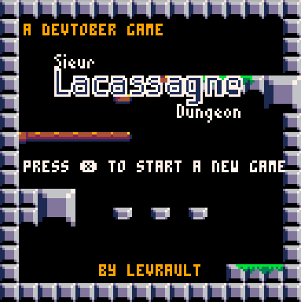

# Post mortem #devtover 2019

For those who are not aware of what is #devtober, it's a challenge created by [ThisIsEllian](https://twitter.com/ThisIsEllian) and it the same thing as #inktober except you work on your games everyday of October instead of your drawing. They are three simples rules

- Work an on a game you made (doesn't matter if it's a work in progress or a new game)
- Post on the [#devtover hashtag on twitter](https://twitter.com/search?q=%23devtober&src=tyah) your daily progress
- Write a post mortem on the 31th october

*You can found more details [here](https://itch.io/jam/devtober-2019)*

I found the concept awesome, so I decide to give it a try. I begun my journey on the 6th (and not the first, was in Canada) and manage to create my own little game in less than a month. I added my own restrictions by 

- It must be a new game
- It must be created with something that I have never work with
- All art must by created by myself

That's how I ended up working and discovering the [Pico 8](https://www.lexaloffle.com/pico-8.php) fantasy console and Lua at the same time. I decided to not be too crazy by choosing to created a 2D platformer. I wanted something fast, simple and fun. So the Pico 8's old school restriction were perfect for me.

That how Sieur Lacassagne Dungeon was created.

## State of the project

I can call it a "success". The game is fully playable, has a solid 60 fps, does seems to be too much buggy and event got music (credit [Gruber](https://twitter.com/gruber_music)) in hit. Code seems to be "good", at least, good for someone that wrote in first line of lua three weeks ago. 

But it miss some features that I couldn't make during the given time. 

- Not enough juicy, I wish I could had some basic particles effects and a momentum attack effects. I blame my lack of knowledge in gamedev in general and the Pico 8. 
- There is no story at all, the player is simply launch in the game.
- UI/Goal/Score could have been some cools features. Like a time attack mode, a hight score management with a cool little UI. 

The game has be set in feature freeze the 24th october and I fixed a lot of remaining issues. I could work a little more longer on the feature but it would at been to much on myself.

## What went wrong

Not that much to be honest. I wish I could have been more innovative and make something that isn't a 2D platformer. But hey, it's like my first "game jam" ever and I really wanted to finish my project. That why I defined a strict simple scope for the game features and focus more on the new technologies.

## What went right

Almost everything!

First of all, the Pico 8 is a lovely engine to work with. The community is really kind too. I ask like two questions ([here](https://twitter.com/LFLangis/status/1186630596732358657) and [here](https://twitter.com/LFLangis/status/1186541203971547136)) and they were like "hey here a solution or hey, you need music, I can make you a tune if you want". I think I should be use to those kind of cool devs, but it's always heartwarming to see people that like their little fantasy console and only want other people to discover it.

Pico 8 work with sharable cartridges with a free access to the source code. What a wonderful system, it's was so easy to find some goods examples.  Three cartridges got my attention and give me some incredible helps to make the project:

- [Advanced Micro Platformer - Starter Kit](https://www.lexaloffle.com/bbs/?tid=28793)[BBS](https://www.lexaloffle.com/bbs)[PICO-8](https://www.lexaloffle.com/bbs/?cat=7)[Cartridges](https://www.lexaloffle.com/bbs/?cat=7#sub=2) to start my game engine 
- [Pico-8 Tunes Volume 1](https://www.lexaloffle.com/bbs/?tid=29008) to get some greats musics.
- [Pico-8 SFX Pack!](https://www.lexaloffle.com/bbs/?tid=34367)  for the sound effects part

So this community system around the Pico 8 was just a great opportunity to achieve the game during the given time.

Even the pixel art was pretty fast to create. I know, my sprite are only 8x8, but I never created something without real pixel art references but I was motivated to make everything of my own. And I did it! Yeah, it's pretty basic but they are my pretty basic pixel art sprites.

## What's next

I'm going back working on [Maximilien adventure](https://github.com/Levrault/godot-maximilien-adventure) a game made with the [Godot engine](https://godotengine.org/) for my nephew Maximilien. There nothing to said about it, I don't thing I will improve Sieur Lacassagne but I'm certainly gonna re-work with Pico 8 for my next game jam.

