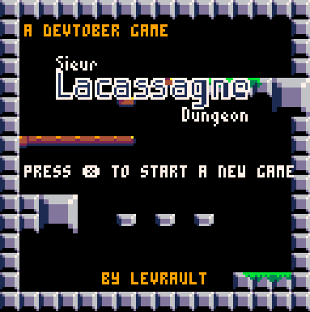
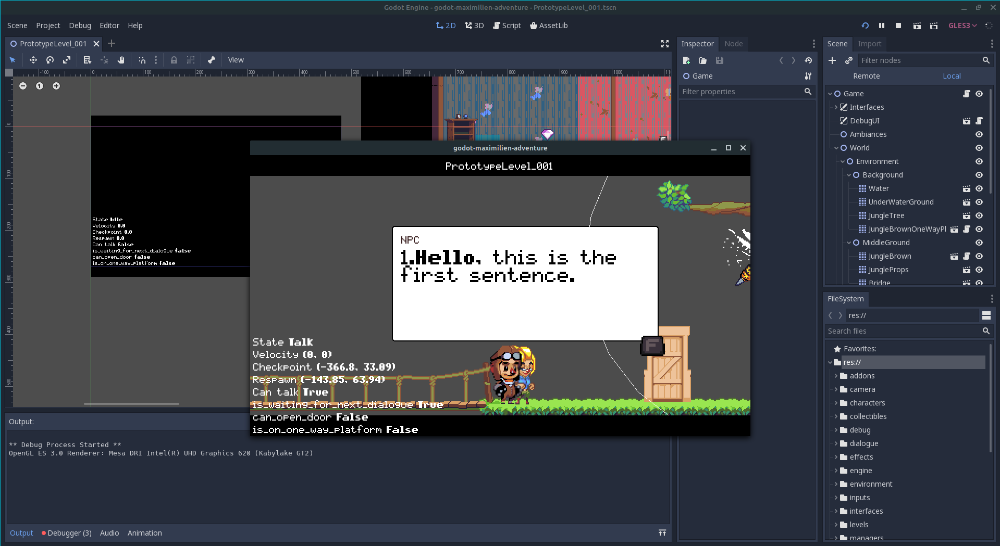

# Sieur Lacassagne dungeon
Sieur Lacassagne dungeon is a retro [Pico8](https://www.lexaloffle.com/pico-8.php) game made during the [#devtober](https://twitter.com/devtober) month (october). 

## Music 

Special thanks to this awesome musician that licensed is music under the Creative Commons.

Track is Dungeon from [Pico8 Tunes Volume 1](https://www.lexaloffle.com/bbs/?tid=29008) made by [Gruber]( https://twitter.com/gruber_music)

# Post mortem #devtober 2019

Ah October, month of spookiness and for month long hashtag challenge like #devtober. For those who are not aware of what #devtober is, it's a challenge created by [ThisIsEllian](https://twitter.com/ThisIsEllian) and it the same thing as #inktober except you work on your game every day of October instead of your drawing. They are three simples rules

- Work an on a game you made (doesn't matter if it's a work in progress or a new game)
- Post on the [#devtover hashtag on twitter](https://twitter.com/search?q=%23devtober&src=tyah) your daily progress
- Write a post mortem on the 31st of October

*You can found more details [here](https://itch.io/jam/devtober-2019)*

I found the concept awesome, so I decide to give it a try. I began my journey on the 6th (a little bit late I know) and manage to create my own little game in less than a month. I added my "own" restrictions to make the challenge more exiting to me: 

- It must be a new game
- It must be created with something that I have never work with
- All art must be created by myself

That's how I ended up working and discovering the fabulous [Pico 8](https://www.lexaloffle.com/pico-8.php) fantasy console and Lua at the same time. I decided to not be too crazy by choosing to make a 2D platformer. I wanted something fast, simple and fun. So Pico 8's old school restrictions were perfect for me.

That how **Sieur Lacassagne Dungeon** was created.

## State of the project

I can call it a "success". The game is fully playable, has a solid 60 fps, does seem to be too much buggy and even got some great music (credit [Gruber](https://twitter.com/gruber_music)). Code seems to be "good", at least, good for someone that wrote his first line of Lua three weeks ago. 

But it misses some features that I couldn't make during the given time. 

- Not enough juicy, I wish I could have some basic particle effects and a momentum attack effects. I blame my lack of knowledge in game dev in general and the Pico 8. 
- There is no story at all, the player is launched in the game.
- UI/Goal/Score could have been some cools features. Like a time attack mode, high score management with a cool little UI. 

The game has been set in feature freeze the 24th October and I fixed a lot of remaining issues. I could work a little much longer on the feature but it would been too much on myself.

## What went wrong

Not that much to be honest. I wish I could have been more innovative and make something that isn't a 2D platformer. But hey, it's like my first "game jam" ever and I wanted to finish my project. That why I defined a strict simple scope for the game features and focus more on the new technologies.

Beside was I already tell in the miss features in the section below, I considered this challenge a wonderful experience in my case. Playing the safe card with a type of game that I know well and setting up a strict scope was just benefic for me.

## What went right

Almost everything!

First of all, the Pico 8 is a lovely engine to work with. The community is really kind too. I ask like two questions ([here](https://twitter.com/LFLangis/status/1186630596732358657) and [here](https://twitter.com/LFLangis/status/1186541203971547136)) and they were like "hey here a solution or hey, you need music, I can make you a tune if you want". I think I should be used to those kinds of cool devs, but it's always heartwarming to see people that like their little fantasy console and only want other people to discover it.

Pico 8 work with sharable cartridges with free access to the source code. What a wonderful system, it's was so easy to find some goods examples.  Three cartridges got my attention and give me some incredible help to make the project:

- [Advanced Micro Platformer - Starter Kit](https://www.lexaloffle.com/bbs/?tid=28793)[BBS](https://www.lexaloffle.com/bbs)[PICO-8](https://www.lexaloffle.com/bbs/?cat=7)[Cartridges](https://www.lexaloffle.com/bbs/?cat=7#sub=2) to start my game engine 
- [Pico-8 Tunes Volume 1](https://www.lexaloffle.com/bbs/?tid=29008) to get some greats music.
- [Pico-8 SFX Pack!](https://www.lexaloffle.com/bbs/?tid=34367)  for the sound effects part

So this community system around Pico 8 was just a great opportunity to achieve the game during the given time.

Even the pixel art was pretty fast to create. I know, my sprites are only 8x8, but I never created something without real pixel art references. I was motivated to make everything of my own this time. And I did it! Yeah, it's pretty basic but they are my pretty basic pixel art sprites.

## What's next

I'm going back working on [Maximilien adventure](https://github.com/Levrault/godot-maximilien-adventure) a game made with the [Godot engine](https://godotengine.org/) for my nephew Maximilien. There nothing to say about it, I don't think I will improve Sieur Lacassagne Dungeon but I'm certainly gonna re-work with Pico 8 for my next game jam. 

This experience was great and let me experience some shorts development times for games, something that I have never done before.